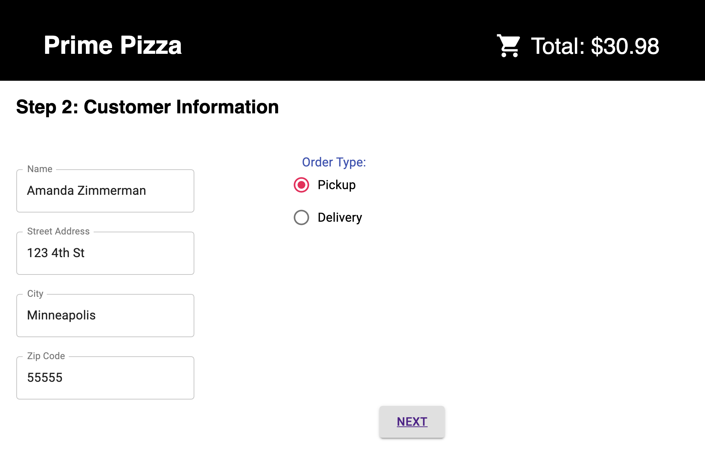
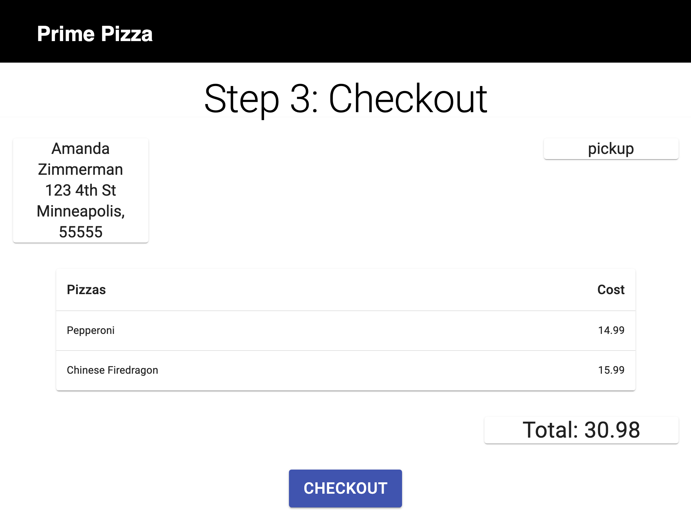
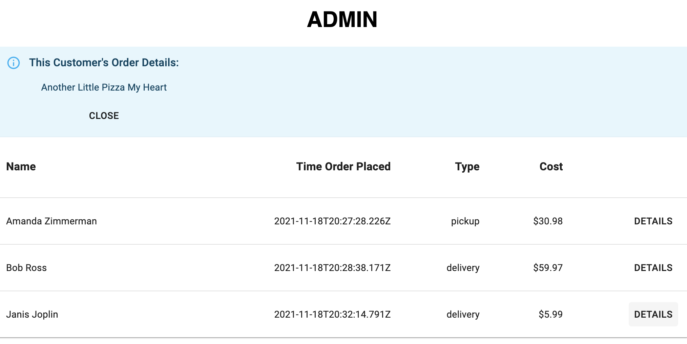

   
    
# Redux Pizza Parlor

*Duration: 4-Day Sprint*

## Table of Contents

- [Description](#description)
- [Screenshots](#screenshots)
- [Built With](#built-with)
- [Getting Started](#getting-started)
  - [Prerequisites](#prerequisites)
  - [Installation](#installation)
- [Usage](#usage)
- [License](#license)
- [Acknowledgements](#acknowledgements)
- [Contacts](#contacts)

## Description

Redux Pizza Parlor is an app that simulates the experience of ordering pizza online. You choose your pizzas and add them to your cart, add your customer orderails such as address and pickup/delivery, confirm the information on the checkout page, and submit the order to be stored in a database. Admins can also view the full order history on an unlinked page. 

## Screenshots

## Built With

## Getting Started

### Prerequisites

Express, Node.js, Postico

### Installation

Fork and clone, and use the database.sql file to use to set up a local database. Run `npm run server` and `npm run client` (in two terminals).

### Usage

Usage should be intuitive: On the homepage, select your desired pizzas and click `Next`. Enter customer info on the page that loads next. The page after that contains the details of your order and a confirmation dialogue asking you to confirm your order. Once you do, your order will be added to the database and you will be rerouted to the homepage. If you go to `/admin`, you will be able to see all details of all orders in the database. Use the `details` button to view the pizzas on each order.

## Workflow

Each member of our team created a `pizza_parlor` database and took primary responsibility for one aspect of the app. Our focus was using React, Redux, and Material UI to create a smooth interactive user experience and a seamless connection to the database via routers, some of which were provided and some built by us. 

#### My Contributions

My personal contribution was to create the Admin page (accessible by visiting `/admin`). I researched  Material UI and its DataTable element for a sleek and modular way to display a list of orders. I utilized Axios to dispatch order details from our database to the DataTable component, formatting it for more human-readable display. 

One stretch goal I accomplished was to also display the individual pizzas from each order on the Admin page. To accomplish this, I made another Axios call which is received in the line item router. There, a `SQL JOIN` query pulls the `line_items`, `pizzas`, and `orders` tables together and sends the result back to the DataTable component. These individual pizzas are displayed when the user clicks the `details` button on each order, which shows them to the user in an MUI alert.

## Acknowledgements

I love my team! Thank you so much [Jen Alexander](https://github.com/jenny-alexander), [CJ Barnes](https://github.com/cee-jay-bee), [Pete Stapp](https://github.com/petestapp), and [Miriam McNamara](https://github.com/MiriamMcNamara) for being such excellent communicators and hard workers during this, our most most complex group challenge yet. Shoutout to [Prime](https://github.com/PrimeAcademy/ "Prime") and our instructor [Dev](https://github.com/devjanaprime/ "Dev") for outlining such an exciting project for us to do.

## Contact Me

  